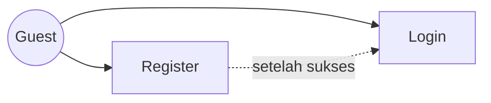
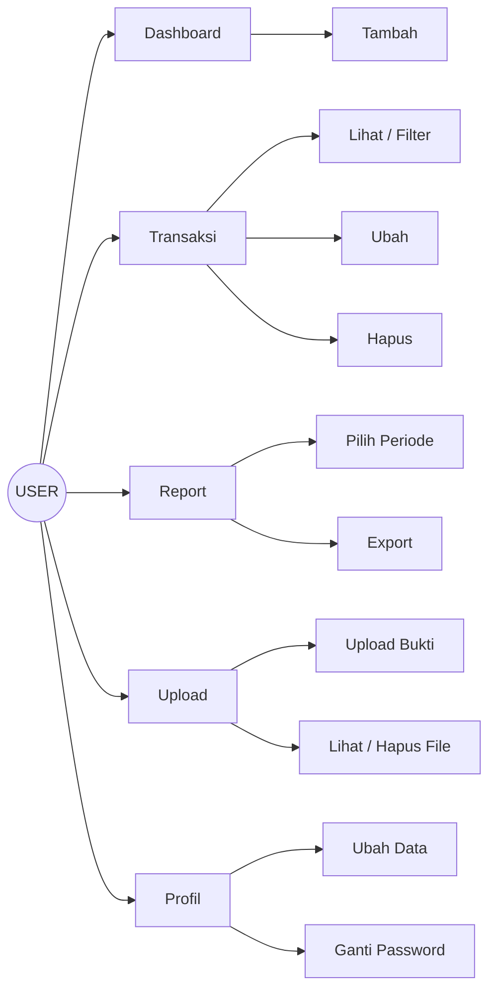
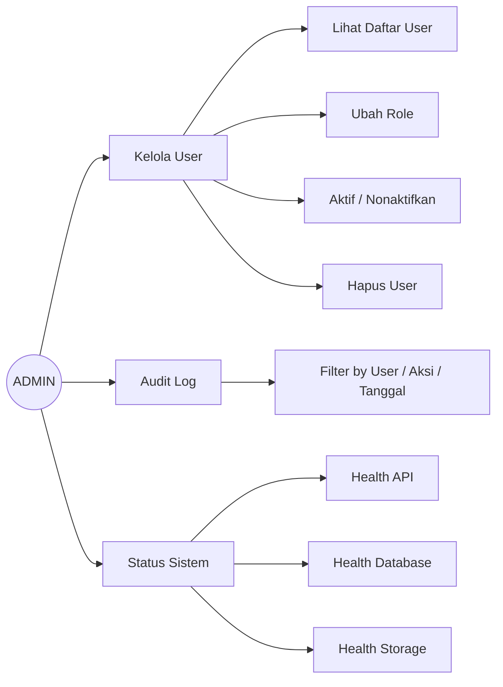
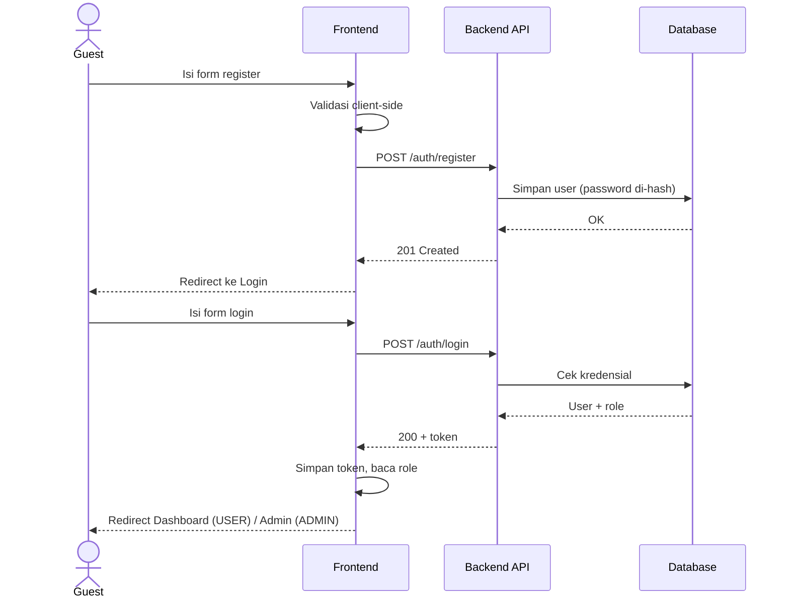
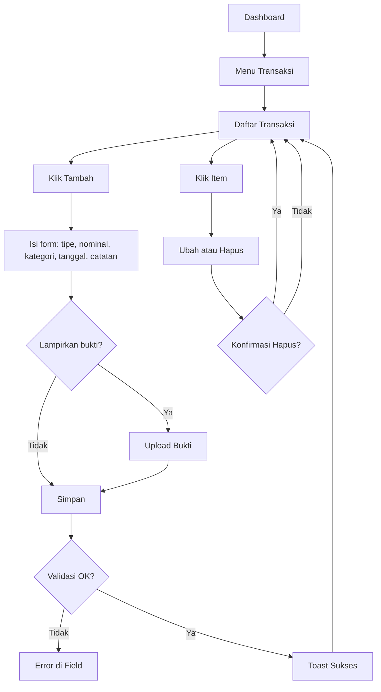
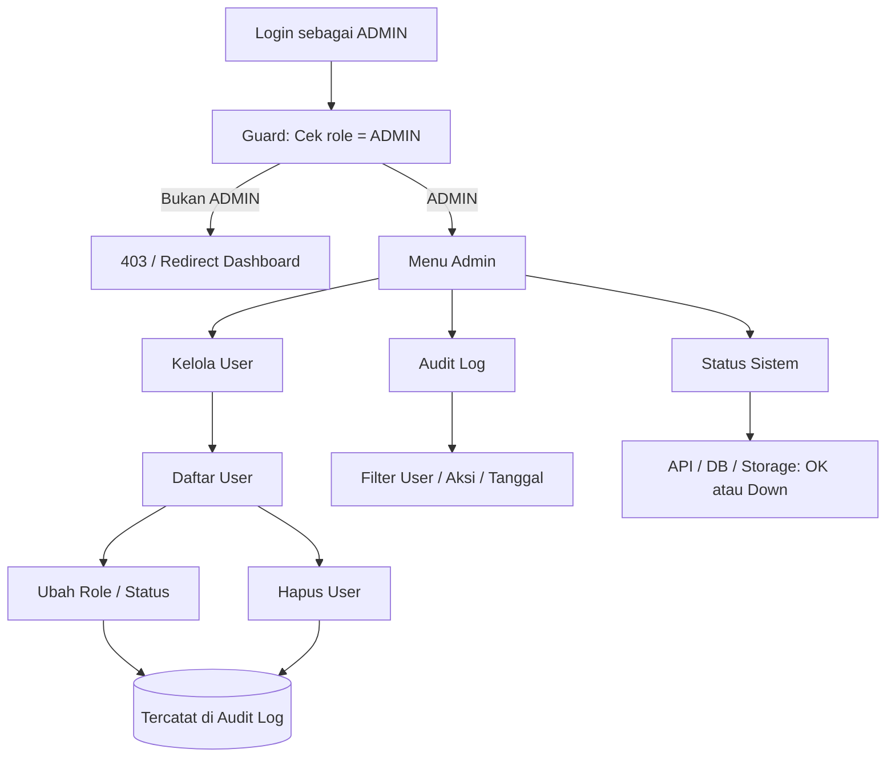

# Use Case Diagram FinCloud

**Owner:** Farelly (Frontend Lead)  
**Status:** Draft v1 — perlu review Backend Lead & PM sebelum merge  
**Catatan:** Diagram dibuat dengan Mermaid (native render di GitHub/GitLab). Mermaid tidak punya tipe use case resmi, jadi dipakai flowchart dengan notasi aktor dan oval.

---

## 1. Aktor

| Aktor | Deskripsi | Hak Akses |
|---|---|---|
| Guest | Pengunjung yang belum login | Register, Login |
| USER | Pengguna terautentikasi (role USER) | Dashboard, Transaksi, Report, Upload, Profil |
| ADMIN | Pengelola sistem (role ADMIN) | Kelola User, Audit Log, Status Sistem (+ akses fitur USER untuk akunnya sendiri) |

---

## 2. Daftar Use Case

### Guest

| ID | Use Case | Deskripsi |
|---|---|---|
| UC-01 | Register | Membuat akun baru (nama, email, password) |
| UC-02 | Login | Masuk dengan email + password, menerima token/session |

### USER

| ID | Use Case | Deskripsi |
|---|---|---|
| UC-03 | Lihat Dashboard | Ringkasan saldo, pemasukan/pengeluaran, grafik, transaksi terbaru |
| UC-04 | Kelola Transaksi | Tambah, lihat, ubah, hapus transaksi (CRUD) |
| UC-05 | Filter & Cari Transaksi | Filter berdasarkan tanggal, kategori, tipe |
| UC-06 | Lihat Report | Laporan keuangan per periode (harian/bulanan) |
| UC-07 | Export Report | Unduh report (CSV/PDF) |
| UC-08 | Upload File | Upload bukti/struk transaksi ke cloud storage |
| UC-09 | Kelola File Upload | Lihat, unduh, hapus file yang sudah diupload |
| UC-10 | Kelola Profil | Lihat & ubah data profil, ganti password |
| UC-11 | Logout | Mengakhiri sesi |

### ADMIN

| ID | Use Case | Deskripsi |
|---|---|---|
| UC-12 | Kelola User | Lihat daftar user, ubah role, aktif/nonaktifkan, hapus |
| UC-13 | Lihat Audit Log | Melihat jejak aktivitas (siapa, apa, kapan) + filter |
| UC-14 | Lihat Status Sistem | Health check API, database, storage, versi aplikasi |

---

## 3. Use Case Diagram

> Gambar diagram utama: `docs/diagrams/usecase-fincloud.png`

**Keterangan notasi:**
- Garis solid = aktor terhubung ke use case.
- include = use case wajib memanggil use case lain.
- extend = fungsi tambahan opsional.

---

## 4. Diagram per Aktor (Lebih Detail)

### 4.1 Guest

### 4.2 USER

### 4.3 ADMIN

---

## 5. User Flow

### 5.1 Alur Utama (End-to-End)

Register -> Login -> Dashboard -> Transaksi -> Report -> Upload -> Admin

### 5.2 Flow Register & Login (Detail)

### 5.3 Flow Transaksi

### 5.4 Flow Admin

---

## 6. Route & Akses

| Halaman | Route (Usulan) | Guest | USER | ADMIN |
|---|---|---|---|---|
| Landing | / | Ya | Ya | Ya |
| Register | /register | Ya | - | - |
| Login | /login | Ya | - | - |
| Dashboard | /dashboard | Tidak | Ya | Ya |
| Transaksi | /transactions | Tidak | Ya | Ya |
| Report | /reports | Tidak | Ya | Ya |
| Upload | /uploads | Tidak | Ya | Ya |
| Profil | /profile | Tidak | Ya | Ya |
| Kelola User | /admin/users | Tidak | Tidak | Ya |
| Audit Log | /admin/audit-logs | Tidak | Tidak | Ya |
| Status Sistem | /admin/system | Tidak | Tidak | Ya |

---

## 7. Update Wireframe

| Halaman | Perlu Wireframe | Status | Catatan |
|---|---|---|---|
| Register | Ya | Belum | Field: nama, email, password, konfirmasi password |
| Login | Ya | Belum | Link ke Register, pesan error |
| Dashboard | Ya | Belum | Kartu ringkasan, grafik, transaksi terbaru |
| Daftar Transaksi | Ya | Belum | Filter + tabel + pagination |
| Form Transaksi | Ya | Belum | Tambah/ubah, slot lampiran bukti |
| Report | Ya | Belum | Pilih periode, grafik, tombol export |
| Upload | Ya | Belum | Dropzone, daftar file, hapus |
| Profil | Ya | Belum | Ubah data, ganti password |
| Admin: Kelola User | Ya | Belum | Tabel user, ubah role/status |
| Admin: Audit Log | Ya | Belum | Tabel log + filter |
| Admin: Status Sistem | Ya | Belum | Indikator API/DB/Storage |
| State kosong / loading / error | Ya | Belum | Semua halaman |

---

## 8. Asumsi & Poin yang Perlu Dikonfirmasi ke Tim

- [ ] Backend: Apakah ada fitur forgot/reset password? (belum dimasukkan)
- [ ] Backend: Format export report — CSV, PDF, atau keduanya?
- [ ] Backend: Batas tipe & ukuran file upload (mis. jpg/png/pdf, maks 5 MB)?
- [ ] Backend: Apakah ADMIN boleh punya transaksi sendiri (diasumsikan ya)?
- [ ] DevOps: Endpoint status sistem apa yang dipakai (mis. /health)?
- [ ] PM: Apakah ada fitur tambahan (budget, kategori kustom, notifikasi) yang belum masuk?

---

## 9. Catatan untuk Reviewer

- Cek kesesuaian use case dengan requirement di `docs/02-requirements.md`.
- Pastikan semua role (Guest, USER, ADMIN) terwakili.
- Pastikan route di section 6 konsisten dengan wireframe.
- Konfirmasi poin-poin di section 8 sebelum merge.